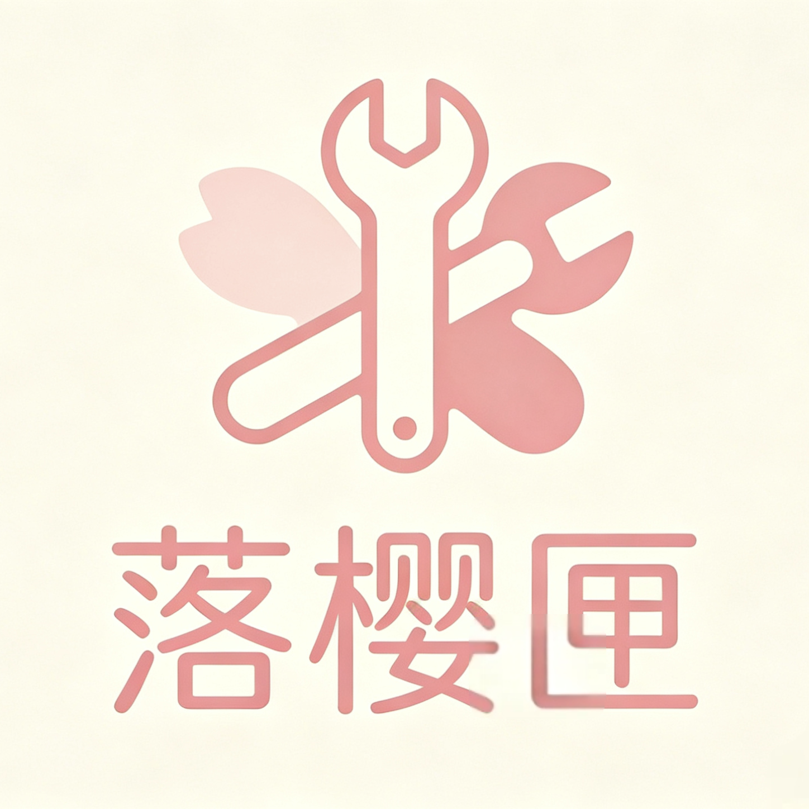

# 落樱匣

<div align="center">
  
  
  **一个温柔的小匣子，装满你需要的实用工具**
  
  [下载 APK](#下载) · [官方网站](https://lycf.club) · [落樱社区](https://bbs.lycf.top)
</div>

## 简介

落樱匣是一款集成了多种实用工具的 Android 应用，提供图片处理、文本转换、编码解码、计算工具等丰富功能，让你的手机成为一个万能工具箱。

## 功能特性

- **多主题切换** - 支持多种主题色和动态取色，随心搭配属于你的风格
- **丰富工具** - 12+ 实用工具，涵盖文本、编码、图片、计算等分类
- **社区交流** - 内置落樱社区（Discourse），用户互助交流
- **极致体验** - Material 3 设计语言，流畅交互，开屏每日一图
- **版本更新** - 支持自动检测更新和强制更新
- **用户系统** - 注册登录、VIP 会员、密码找回

## 内置工具

| 分类 | 工具 |
|------|------|
| 文本 | 字数统计 |
| 编码 | Base64、URL 编码、JSON 格式化、二维码生成、JWT 解码器 |
| 图片 | 图片压缩 |
| 计算 | 时间戳转换、单位换算、进制转换、密码生成器、颜色转换器 |

## 截图

<div align="center">
  
</div>

## 技术栈

- **前端**：Flutter (Dart)
- **后端**：Next.js 16 + TypeScript + Prisma
- **数据库**：MySQL
- **社区**：Discourse
- **支付**：易支付

## 项目结构

```
lib/
├── config/         # 配置文件（API、工具、主题）
├── models/         # 数据模型
├── pages/          # 页面
│   ├── auth/       # 登录、注册、重置密码
│   ├── tools/      # 各工具页面
│   └── ...
├── services/       # 服务层（API、认证、VIP等）
├── theme/          # 主题系统
└── widgets/        # 公共组件
```

## 编译

```bash
# 安装依赖
flutter pub get

# 运行
flutter run

# 打包 APK
flutter build apk --release
```

## 下载

- **APK 下载**：前往 [发布页面](../../releases) 下载最新版本
- **系统要求**：Android 5.0+
- **官网**：[https://lycf.club](https://lycf.club)

## 相关链接

- [落樱社区](https://bbs.lycf.top) - 用户交流、问题反馈
- [官方网站](https://lycf.club) - 了解更多

## 开源协议

本项目采用 MIT 协议，详见 [LICENSE](LICENSE)。

---

<div align="center">
  © 2026 落樱匣 · 保留所有权利
</div>
